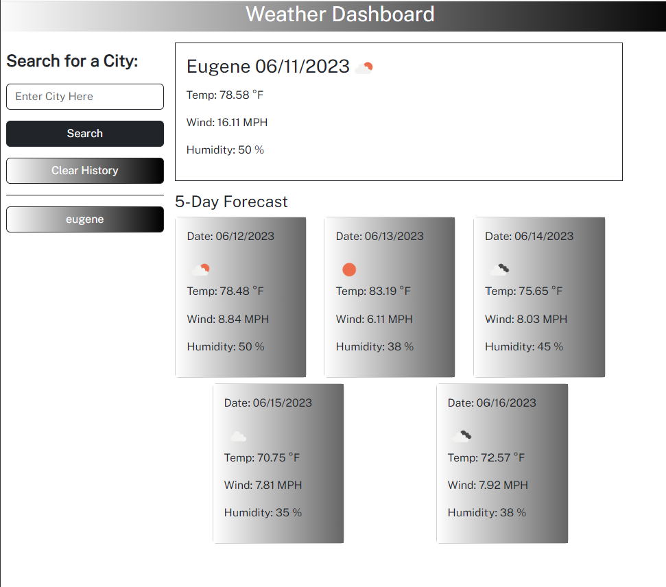

# Weather-Forecast
5 Day Weather Forecast

## Description

I built this project for the purpose of practicing using Bootstrap, creating/manipulating elements in the DOM via JQuery, utilizing API calls/response data, and saving/updating elements based on user inputs. This project is focused primarily on the following:
Styling elements for responsive design via Bootstrap.
Creating elements in the DOM via JQuery.
Using the dayjs() method to convert unix/UTC timestamps to a date format.
Utilizing API calls to retreive data.
Manipulating dynamically created elements to display data from an API call response.
Saving/accessing updates to Local Storage

This project can be found here:

https://edwinalban.github.io/Weather-Forecast/

## Technologies Used

* JavaScript
* JQuery
* Bootstrap (CSS Framework)
* Day.js
* HTML
* CSS

## Usage

The project can be used to practice styling pages via Bootstrap, and using JQuery for traversing the DOM, selecting elements in the DOM for manipulation, adding Event Listeners (specifically "click" events), running functions as a result of user clicks, making API calls, targeting specific data within an API response, setting strings to local storage, and retrieving objects from local storage.

